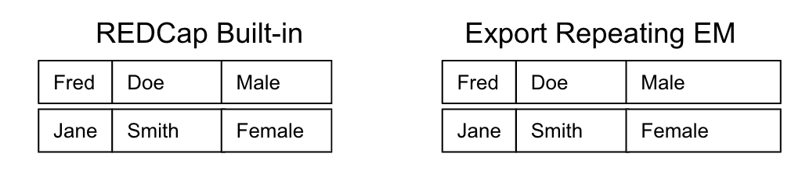
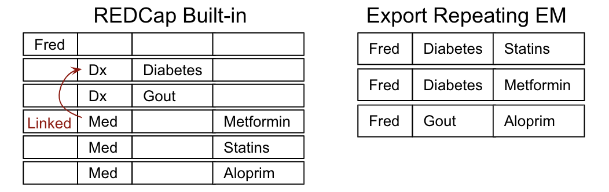
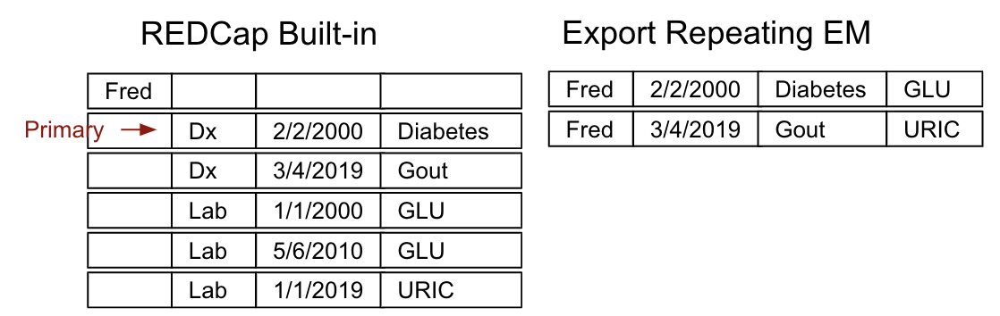

# Export Repeating Data External Module
### Users' Guide
The end-user documentation for this EM is [users_guide.md](./documentation/users_guide.md)
### What does it do?
Native support for data reporting and export in REDCap does not work
particularly well with repeating forms data. 

Here are the reporting 
scenarios to consider:
1. All data in the report belongs to singleton (non-repeating) forms. 
There is one row in the report for each record in REDCap. The behavior in this
case is the same in this EM as in the built-in REDCap data export.    

1. The report includes data from one or more singleton forms but also includes
data from just one repeating form. REDCap's built-in data export format
places the data from the repeating forms on separate rows
from the data in the singleton form(s), i.e. if you are exporting
one record with two repeating form instances, there will be three
rows in the report: one with the data from the singleon form,
and two for the data from the repeating form instances,
with blanks liberally sprinkled throughout. By contrast, this EM produces a
densely populated report
in which there is one row per repeating form instance, with
the singleton form field values repeated in-line (this process is known as "de-normalization":"). 
So if are exporting
one record with two repeating form instances, there will be only
two rows, completely filled in with data, and both rows will have
the same information for the corresponding singleton form fields.  
For example, we could have a singleton form capturing patient information such as patient name,
and a repeating form used to capture diagnoses.     

2. One or more repeating instruments with optional 
singleton instruments, where the repeating instruments are linked with
the [Instance Select EM](https://github.com/lsgs/redcap-instance-select). 
Any singleton values are copied into each row,
and fields from linked repeating instruments are copied into the row 
they correspond with.     

3. One or more repeating instruments with optional singleton
instruments, where the repeating instruments are *not* linked. 
If both forms have date fields, a repeating instrument can be designated
as the ‘primary’ for reporting purposes. Fields from other repeating instruments can be added to the 
report by selecting matching rows by date proximity.     
For example, you might have a set of datestamped diagnoses
and a companion set of datestamped lab results. You could craft
a report of all diagnoses with the closest associated lab result
by selecting the diagnosis instrument as the primary, then supplying 
date ranges for allowable association of a lab result when prompted to do so by the UI.
In the case where multiple results fall within the specified time frame,
the closest one is selected. In the case of a tie, the tie is broken arbitrarily. 

### Recommended Companion EMs
As described in Scenario 3 above, this EM works very nicely in conjunction with 
 [Instance Select EM](https://github.com/lsgs/redcap-instance-select), though its use is optional.

Also note that projects with linked repeating data (aka "relational" data) frequently find it convenient
to conduct data entry for related records from inside the
context of the parent instrument. This workflow is nicely supported
by the [Instance Table EM](https://github.com/lsgs/redcap-instance-table),
a companion EM to "Instance Select". The "Instance Select" and "Instance Table" EMs work well 
together; a project that uses them both in conjunction with this reporting EM can produce
a plausible approximation of an underlying relational database.
### Project Configuration Instructions
To enable this EM on a project with repeating data, you will likely need to add action tags to indicate the data relationships.
If your project fits entirely within scenarios 1 and 2 above, that is, you have at most one
form with repeating data, no additional configuration is required. 

If you have more than one repeating form, however, you need to add action tags as follows:
A) All repeating forms with at least one date field needs the @PRINCIPAL_DATE action tag
applied to the primary date field for that form, and
B) All child forms should have an @FORMINSTANCE=parent_instrument action tag applied to
one of the fields in the form.  Assuming you are also configuring an instance table
in the parent to summarize the child records, the obvious field to add this action tag
to is the field used to capture the parent instance number, but any field on the child instrument will work.

### Implementation Notes
The [user-specified](./documentation/users_guide.md) instruments and filters  are processed in multiple passes, as follows
1. First the specification is searched for instruments that are linked by an
   "Instance Select" action tag. 
   SQL is generated that inner joins all child instruments to the parent
   using the relationships specified in the action tag and also applying any relevant filters*. 
   This SQL is then cached for later use.
2. In the second pass, the outer select is generated with columns in the user-specified order.
   The resulting SQL fragment is then stashed in a variable for reference later
3. In pass #3, we start to actually build up the SQL query, starting with all singleton forms.
   Singleton data can either stand on its own or, if one or more repeating forms are 
   included, singleton data should be inner joined to the primary repeating form. 
4. In the final pass we go back through the supplied list of instruments, skipping over
   singleton instruments and children linked to an "Instance Select" parent,
   since both have already been dealt with. If the instrument is the parent in an "Instance Select"
   relationship, its cached SQL is now appended to the final query; otherwise a "date proximity" pattern
   is used to generate the SQL for the inline table. In both cases the inline table SQL is joined
   with a suitable join clause, 
   namely, an inner join if the instrument being joined to was non-repeating aka singleton, otherwise a left outer join.
   
Then at the very end the outer select from the 2nd pass is prefixed to the start of the query, and if the user is merely
previewing the data a limit clause is added to the very end.

*The application of filters inside each relevant inline table rather than globally applying them to
the entire SQL statement allows the end user to use filters in conjunction with date proximity
without then unexpectedly losing rows of data from the primary repeating form.

Last Updated: 01/14/2021 11:45am
