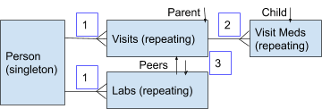

# Review / Export Data Users Guide
## Overview
REDCap built-in reporting works well for standard projects without repeating forms, but becomes more challenging to use 
on projects with repeating forms.

The ‘Review / Export Data’  External Module (EM) for REDCap allows you to export data in a denser format than the 
built-in reporting, enabling you to retrieve data even for very large datasets. 

You can also use it as a record finder, as each row in the preview report is hyperlinked back to the underlying record
in REDCap.

To launch this EM, scroll down on the right hand side to the section labeled “External Modules”, 
and click on the ‘Review / Export Data’ hyperlink in that section.

Once launched, you will see a screen similar to this:

### A. Report Name. 
Specify the name of the file for your exported data or settings. Not required for preview.

### B. Instruments and Fields. 
Here you should see a familiar looking list of all instruments and fields in your project, in the order specified in your project’s data dictionary, displayed in a hierarchical tree control. Instruments are tagged with a black document icon; fields have no icon, just the variable name. You will use this list to specify which columns to include in your report along with any filters to apply to limit the number of rows returned. Single click on an instrument name to toggle back and forth between showing and hiding its associated fields.

### C. Filter Rows. 
Optionally drag a field from the left hand side and drop it into this box to start the process of specifying a row filter. To complete a filter, select the operation from the dropdown and specify the parameter in the text/dropdown field. If multiple filters are used, select the appropriate boolean logic operand used to join the filters. The final boolean operator is ignored. To discard a filter, click the  x  on the far right. Note that filters cannot be re-ordered, so if ordering is important, you should drop the filters into this control in the order you wish them to be evaluated.

### D. Record count. 
This feature allows you to count the distinct records in your REDCap rather than patients in the clinical dataset. When you are satisfied with your filter settings, click the “count” button in the upper right corner to trigger a database query that will return the number of matching records.  Note that this is very likely a different number than the final number of rows returned in your data report; this count is of the distinct number of matching records. If you have repeating data associated with these records, the number of rows in the data report is likely to be much larger.

### E. Report columns. 
Drag an instrument or field from the left hand side and drop it into this area to create a new control consisting of checkboxes for all the fields in the given instrument. If you drop an instrument, all fields will be selected. If you drop a field, only that field will be selected. You can then turn other fields on and off using the checkboxes. You can also show/hide the checkbox panel using the small control to the left of the panel name in the colorful panel header. This can come in handy when working with instruments having many fields.

Configuring a report with multiple instruments is covered in the “Reporting on Multiple Forms” section below.

### F. Preview data. 
Click this button to see a data preview in your browser of the report you have specified. Note that previews will only return a limited number of rows. The default limit is 200 rows, but this can be re-configured by a REDCap project admin by clicking on the ‘External Modules’ link on the left hand side, clicking the “Configure” button next to “ExportRepeatingData - v9.9.9”,  and specifying the new row limit.

Note that since each row in this view is hyperlinked back to the underlying record, you can use this EM as a sophisticated record finder as well as a data export tool.

### G. Export Data. 
Once you are satisfied with the data returned in the preview, click “Export Data” to trigger a data download of the full dataset. The returned file will be named with the name supplied in the Report Name field, or “unnamed_report” if left blank. The only file format supported at this time is comma separated (.csv). This may take a few minutes; the spinner control indicates that the system is still waiting for a response from the server.

### H. Labels / Raw. 
As with REDCap’s built in reporting, you have the option of specifying whether you want the raw (coded) data, or the data labels.

### I. Save Settings. 
When you go to the trouble of creating a complex report, it can be handy to save all your settings to re-run the report at a later date. To export all your settings in a format that can be used to restore them later, click “Save Settings”. As with data export, the file name will reflect what you typed into the Report Name field. The file type is .json.

### J. Load Settings. 
To load a saved .json file, click this button, then drop the saved .json into the drop area that pops up.

## Reporting on multiple forms
Reporting on non-repeating forms works in much the same way as built-in REDCap reporting. The true power of this EM is how it reports on data in projects with multiple repeating forms.
### Data Relationships
When this EM is enabled on your project, a project administrator has to make some decisions about data relationships.  The options are
1. A repeating form is related to a singleton (non-repeating) form
1. A repeating form is the child of another repeating form, and
1. A repeating form is the peer of another repeating form

For example, suppose your project tracks all clinic visits for a patient along with all labs for a patient; the visit and lab instruments each have their own separate date fields. A report joining patient information with visit information would be scenario 1.  And a report joining patient data to lab data would also be scenario 1. 

If you also collect details on all current medications being taken by the patient at each visit, that form can be configured as a child to the parent visit by adding a field to the child form that tracks which parent instance it is related to. This special field on the child form is identified with the @INSTANCETABLE_REF action tag. When you build a report with two forms linked by this action tag, you are in scenario 2. 

But more typically you will have multiple sets of repeating data all related to the patient, e.g. multiple visits and multiple lab results. Each of these repeating forms must have a date field tagged with the action tag @PRINCIPAL_DATE; if a repeating form does not have a date field with this tag it will be considered a configuration error by the EM. When you build a report with both visit data and lab data that have been correctly configured you are in scenario 3.
#### Scenario 1
In Scenario 1, you join non-repeating (Singleton) data with data from one repeating form.
The first repeating form in the list is considered the primary, or anchor, instrument for the report. This means that every instance of data in this instrument that matches the supplied report filters will be included in the final report. So when you join one repeating form with a non-repeating form, you will see the non-repeating form data replicated for each matching row of the primary repeating form. For example, patient 1, who lives in California, has had two visits, one in July, the other in August. The report has one row for every visit instance in the REDCap project, with associated patient information replicated on each corresponding row.

#### Scenario 2
In Scenario 2, you join data on instruments linked in a parent-child relationship. This report behaves in much the same way as a Scenario 1 report in that the parent data is replicated on each corresponding row of the child data. 

For example, record 1 had 2 visits, each of which had two different associated medications, medications A and B on the July “Clinic” visit and medications C and D on the August “Well Baby” visit.

#### Scenario 3
Scenario 3 is the interesting one. Bear in mind that the order in which you sort the repeating form panels determines how your data will be reported out.   The first repeating form in the list is treated as the anchor for the report. All other peer repeating forms added to the report specification will be labeled as “Repeating: Pivot & Filter”. So when crafting a report involving multiple peer instruments you first need to decide which of them will be the driver for the report. For example, if you have three peer repeating forms Visit, PFT and Walk, this is what the interface will look like when Visit is selected as the anchor,

And this is what it will look like when PFT is selected:

The primary instrument determines what data is included in the report. An instrument labeled as "Repeating: Pivot & Filter" may add columns of data, but will not add any rows.   Either one or zero values from the secondary form will be included in the final report, such that the included value in the secondary instrument is the one closest in time to the principal date of the primary within the specified date proximity limits.  If you leave a date field blank, the system fills in 999, which is just a few months short of 3 years.

For example, assume patient 1 has two visits, one in July, the other in August, and three PFT test results in January, June and September. 
If you write a report with Visit as the Primary and PFT as the secondary, specifying a 2 day before and after limit, you will get back two rows for the two visits, with blanks for the PFT test results, as none of the PFT tests occurred within 2 days of a visit.

If you write a report with Visit as the Primary and PFT as the secondary, specifying a 45 day before and after limit, you will get back two rows for the two visits, with data for the nearest PFT test results, one of which happened prior to the visit (June prior to July), the other after (Sept after August). The PFT test results from January will be filtered out as the June result was the closer match to the first visit.

And if you write a report with Visit as the Primary and PFT as the secondary with no limits, you will get back three rows, including two rows for the July visit, one with the matching PFT form January, the other with the match from June.

_Handy tip:_ when reordering column panels you can hide the associated checkboxes by clicking on the control button next to the instrument name in the column panel header.

## Technical Support
If you have questions or wish to report an issue with this EM you can contact the REDCap team by clicking on the blue ‘Contact REDCap Administrator’ button in the lower left of your REDCap project.
